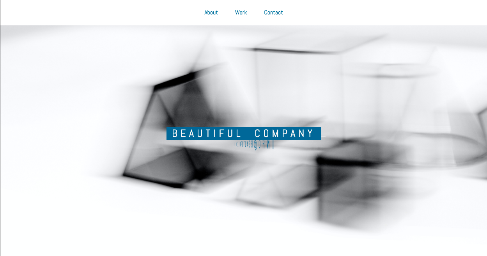
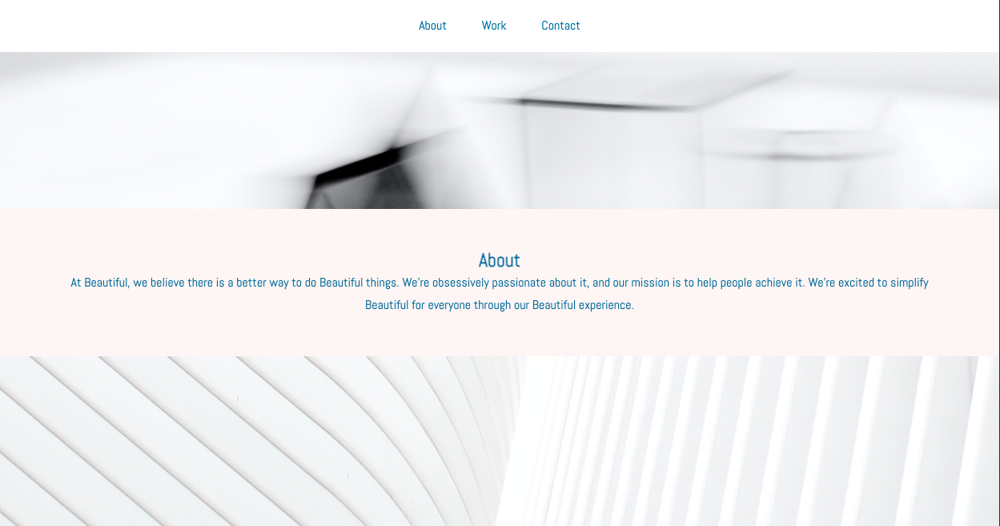
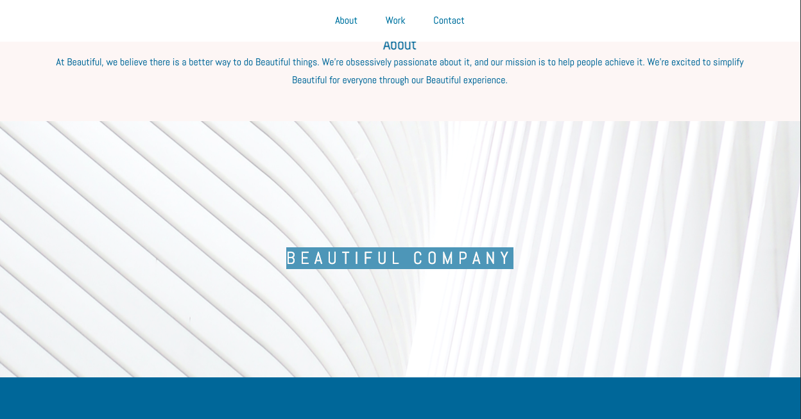

# parallax
## Parallax and Animate CSS Company Website

### Parallax scrolling is when the website layout sees the background of the web page moving at a slower rate to the foreground, creating a 3D effect as you scroll.
### Animate.css is a library of ready-to-use, cross-browser animations for use in your web projects. Great for emphasis, home pages, sliders, and attention-guiding hints.  Here is an example... 

